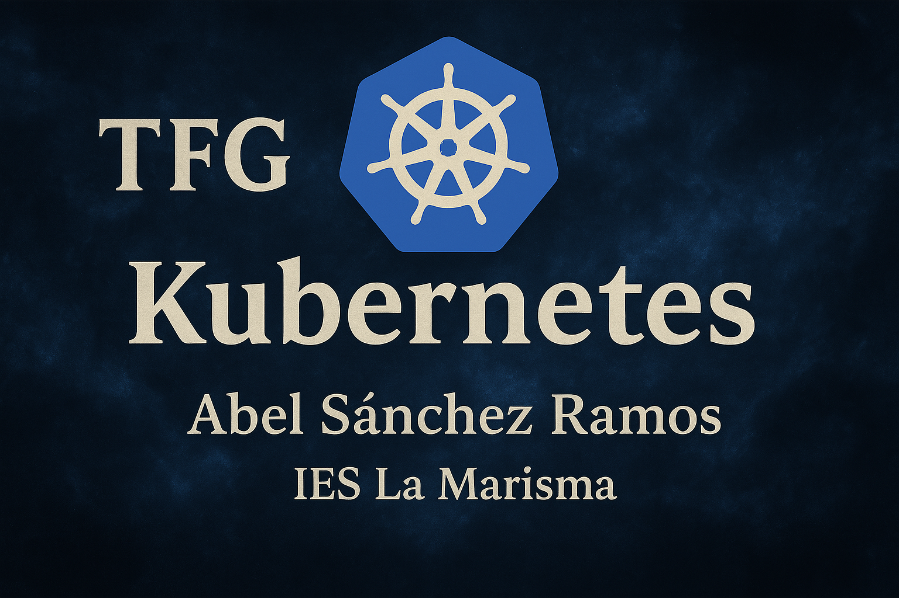

  

<h1 style="text-align: center; color: #2b6cb0; font-size: 2.8rem; font-family: 'Segoe UI', sans-serif;">TFG</h1>

<h2 style="text-align: center; color: #2a4365; font-size: 1.4rem; font-weight: normal;">Ciclo Formativo de Grado Superior en Administración de Sistemas Informáticos en Red (ASIR)</h2>

<h3 style="text-align: center; color: #4a5568; font-weight: normal;">IES La Marisma</h3>

  Este repositorio corresponde a mi Trabajo de Fin de Grado (TFG) del ciclo ASIR. Se ha trabajado de forma <strong>individual</strong>, combinando conocimientos de virtualización, redes, administración de sistemas Linux, seguridad y automatización de servicios.

<h2 style="margin-top: 40px; color: #2a4365;">🧩 Tecnologías y herramientas utilizadas</h2>
<ul style="padding-left: 20px; font-size: 1rem;">
  <li>Kubernetes (Minikube y/o K3s en entorno local/laboratorio)</li>
  <li>Docker para contenerización</li>
  <li>Ubuntu Server como sistema base</li>
  <li>VirtualBox y/o Proxmox</li>
  <li>Helm, kubectl, YAML</li>
  <li>NGINX, Apache, MySQL</li>
  <li>Git y GitHub para control de versiones</li>
  <li>VS Code, nano, tmux, etc.</li>
</ul>

<h2 style="margin-top: 40px; color: #2a4365;">📌 Objetivos del proyecto</h2>
<ul style="padding-left: 20px; font-size: 1rem;">
  <li>✅ Montar un clúster Kubernetes funcional en entorno local</li>
  <li>✅ Desplegar contenedores y servicios comunes</li>
  <li>✅ Gestionar la alta disponibilidad, escalabilidad y actualizaciones</li>
  <li>✅ Implementar monitorización y registro de eventos</li>
  <li>✅ Documentar todo el proceso (manual técnico y de usuario)</li>
</ul>

<h2 style="margin-top: 40px; color: #2a4365;">📄 Licencia</h2>

  Este proyecto es de uso académico. Puedes utilizarlo como referencia, pero no está permitido copiarlo íntegramente para otros fines sin autorización.

